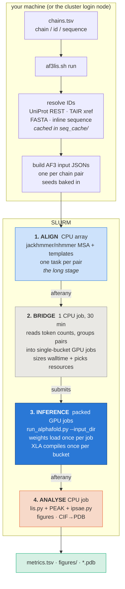

# af3lis — one-command AlphaFold-3 interface screening on SLURM

Give it two lists of proteins. It folds every pair with AlphaFold 3 on a
cluster, scores every interface, and hands back structures, PAE matrices, a
metrics table and figures. One command, one dependency chain, no babysitting.

```bash
git clone https://github.com/Papareddy/af3lis.git && cd af3lis
bash af3lis.sh setup                              # build the analysis env, check the cluster
cp config.example.yaml config.yaml                # fill in your cluster paths
bash af3lis.sh template chains.tsv                # starter input file
bash af3lis.sh run --chains-tsv chains.tsv --name MyScreen
```

That submits everything and returns. When the last job finishes you have:

```
runs/MyScreen/
  metrics.tsv                 every metric, one row per chain pair
  figures/
    peak_vs_ilis.png          interface confidence, hit quadrant shaded
    ranked_hits.png           top pairs by iLIS
    heatmap_iLIS.png          chain-A x chain-B grid
    heatmap_PEAK.png
    pae/<pair>.png            PAE matrix per pair, chain blocks marked
  out_pack/<pair>/            AF3 output: *_model.cif, *.pdb, confidences.json
  groups.tsv                  what each GPU job was given and why
  logs/                       one log per stage
```

Inputs can be **UniProt accessions**, **TAIR loci**, **FASTA files**, or raw
sequences pasted into the input file — mixed freely in one run.

---

## Contents

- [How it runs](#how-it-runs)
- [Resources on Helix, and how the GPU is chosen](#resources-on-helix-and-how-the-gpu-is-chosen)
- [Input formats](#input-formats)
- [Software and the environment](#software-and-the-environment)
- [Commands](#commands)
- [Verify it works — the smoke test](#verify-it-works--the-smoke-test)
- [Options](#options)
- [Configuration](#configuration)
- [Reading the metrics](#reading-the-metrics)
- [Metrics — provenance](#metrics--provenance)
- [Traps that cost real time](#traps-that-cost-real-time)
- [Credits & citation](#credits--citation)

---

## How it runs

Four SLURM stages, chained by dependency. You submit once; SLURM does the rest.



**Why a bridge job rather than one big array.** Token counts are only known
after the MSAs exist, so the grouping decision cannot be made at submit time.
The bridge runs on a cheap CPU slot once alignment finishes, reads the real
sizes, and submits GPU jobs shaped to them.

**Why `afterany` everywhere, not `afterok`.** Under `afterok` a single failed
alignment task strands every downstream job in `DependencyNeverSatisfied`
forever, and you get nothing. Under `afterany` the chain always advances:
the bridge packs whatever MSAs landed and prints a `MISSING:` line for each one
that did not, and the analyse job scores whatever models exist. A partial run
gives you partial results plus an explicit list of what to re-run.

---

## Resources on Helix, and how the GPU is chosen

Each packed job holds exactly **one token bucket**, so its size class is known
before submission and the job can ask for what it actually needs. AF3 pads
every input up to the next bucket on its ladder
(256, 512, 768, 1024, 1280, 1536, 2048, 3072, 4096, 5120), and
`af3lis.pack.resources_for()` maps that bucket onto SLURM resources:

| tokens (bucket) | `--gres` | `--mem` | flash attention | `XLA_CLIENT_MEM_FRACTION` | why |
|---|---|---|---|---|---|
| ≤ 1536 | `gpu:A100:1` | **48gb** | `triton` | 3.2 | fits a 40 GB card; 48 GB keeps the **26 abundant gpu4 nodes** eligible |
| 2048–3072 | `gpu:A100:1` | 60gb | `triton` | 3.2 | still under the 64 GB cutoff; more host RAM for unified-memory spill |
| ≥ 4096 | `gpu:A100:1` | 96gb | `xla` | 4.0 | needs an 80 GB card (gpu8) and the XLA attention kernel |

**The memory ladder is not "bigger is safer".** On bwHelix, asking for
**≥ 64 GB excludes the 26 abundant 40 GB gpu4 nodes** and restricts the job to
4 scarce gpu8 nodes. A needlessly large `--mem` therefore costs hours of queue
time, not just accounting. Small buckets stay at 48 GB on purpose; only
≥ 4096-token jobs escalate, because those genuinely will not fit otherwise.

Everything above is emitted into `af3pack/submit_all.sh` as explicit `sbatch`
overrides and recorded in `groups.tsv`, so the choice is auditable after the
fact:

```bash
# groups.tsv
group             bucket  n_conditions  est_min  walltime  gres        mem    flash_attn  xla_mem_frac  members
group_000_b768    768     6             44.7     01:00:00  gpu:A100:1  48gb   triton      3.2           ...
group_003_b4096   4096    2             180.0    04:00:00  gpu:A100:1  96gb   xla         4.0           ...
```

### Why inference is packed, not one job per fold

Measured on bwHelix, and the reason the default changed:

| | per-task array | packed |
|---|---|---|
| weights load + XLA compile | once **per prediction** (~3.3 min measured) | once **per job** |
| scheduler age | array tasks **forfeit** accrued age on activation | fat jobs keep it |
| jobs in the accrual window | 1 per fold, blows past `MaxJobsAccruePU=100` | a few dozen |

On a 20-condition × 5-seed run this measured **2.78 h of GPU time packed
against 3.60 h as an array** — 49 minutes saved on compile alone, a 1.29×
reduction that scales linearly with the number of folds. The queueing effect is
larger but harder to measure without a matched control.

### Walltime sizing, and why you should calibrate

Walltime per group is
`(startup + compile + n_conditions × sec_per_condition × n_seeds) × safety`.
The built-in `sec_per_condition` table was measured only at buckets **512 and
768**; everything else is a `bucket^2.2` extrapolation and over-asks by roughly
2.4×, which hurts backfill. For a new size class or a different GPU, measure
first:

```bash
bash af3lis.sh run --chains-tsv chains.tsv --name Probe --probe 10   # one short GPU job
python -m af3lis.calibrate runs/Probe/logs/pack_*.out --out runs/Probe/calib.json
bash af3lis.sh run --chains-tsv chains.tsv --name Real --calib runs/Probe/calib.json
```

---

## Input formats

### chains.tsv (recommended)

Tab-separated. A header row is optional. Blank lines and `#` comments ignored.

```tsv
chain   id          sequence
A       UFL1
A       P0DTC2
B       AT1G01010
B       MyMutant    MKVLSPADKTNVKAAWGKVGAHAG...
```

| column | meaning |
|---|---|
| `chain` | `A` or `B` (also accepts `1`/`2`). In grid mode every A is folded against every B. |
| `id` | UniProt accession, TAIR locus, or a label resolved from `--fasta` / column 3. |
| `sequence` | **Optional.** Supply it and `id` becomes a label only — no network lookup. This is how you fold truncations, point mutants and tagged constructs. |

Two-column files are fine. Duplicate rows are dropped (first wins) so a
repeated bait cannot silently produce duplicate folds.

### The alternatives

```bash
# inline lists
--chainA UFL1,UFC1 --chainB DDRGK1,CDK5RAP3

# sequences from FASTA (labels come from the headers; wins over inline TSV sequences)
--fasta my_proteins.fasta

# one multi-chain assembly instead of a pairwise grid
--mode complex --complex-name UFM_E3 --chainA UFM1,UBA5 --chainB UFC1
```

ID resolution order for each token: `--fasta` override → inline TSV sequence →
raw sequence → UniProt accession → TAIR locus lookup. Results are cached in
`seq_cache/`, so a re-build is offline.

---

## Software and the environment

**Built once, loaded every time.** `bash af3lis.sh setup` creates a conda env
**inside the clone** at `env/.conda` from `env/af3lis.yml`, then writes
`env/activate.sh`. Every later invocation — including each SLURM job — sources
that file and gets the same interpreter. There is nothing to activate by hand
and nothing in your shell profile to break.

```
env/af3lis.yml     the spec:   python 3.11, numpy, scipy, pandas,
                               matplotlib-base, pyyaml, pytest
env/.conda/        the env      (gitignored; created by setup)
env/activate.sh    the loader   (gitignored; generated by setup)
```

Overrides, in order of precedence: `AF3LIS_PYTHON` (use your own interpreter) →
`env/.conda` → whatever `python3` resolves to. So if you already keep a conda
env with the analysis stack, point `AF3LIS_PYTHON` at it and skip the build.

**AlphaFold 3 itself is deliberately NOT in that env.** It comes from the
cluster module (`af3_module` in `config.yaml`, e.g. `bio/alphafold/3.0.1`),
because the JAX/CUDA build has to match the site's drivers, and the model
weights are gated by DeepMind and must be requested and placed in
`model_dir` yourself. The env here is only for building inputs, packing,
scoring and plotting.

| where | what provides it |
|---|---|
| MSA + inference | cluster AF3 module + `$ALPHAFOLD_DATABASES` + your `model_dir` weights |
| build / pack / score / plot / PDB | `env/.conda` from `env/af3lis.yml` |

**Why this is not optional:** the login and compute nodes on bwHelix ship a
python without pandas, so `import af3lis` fails there and the pipeline cannot
score its own output. That is the whole reason `bootstrap.sh` exists. The
analyse stage checks for pandas up front and tells you to run it rather than
dying in a traceback halfway through.

---

## Commands

| command | what it does |
|---|---|
| `af3lis.sh setup` | build `env/.conda`, write `env/activate.sh`, check for `sbatch`, the AF3 module and the weights. Run once after cloning. |
| `af3lis.sh template [path]` | write a starter `chains.tsv`. |
| `af3lis.sh run --chains-tsv F --name N [opts]` | build inputs **and** submit the whole chain. Any extra option is passed through to `pipeline.py`. |
| `af3lis.sh status N` | queue state plus what is on disk: MSAs, models, metric rows, figures, PDBs, and the last `MISSING:`/`ERROR` log lines. |
| `af3lis.sh smoke [name]` | 12-fold end-to-end verification run (see below). |
| `af3lis.sh check [name]` | assert a finished run is complete; exits non-zero on failure, so it is usable in CI. |
| `af3lis.sh report N` | re-score, re-plot and re-export PDBs for a finished run without touching SLURM. |

Add `--dry-run` to `run` to write `SUBMIT_CMDS.sh` and submit nothing. The file
is a sourceable shell script, so you can inspect the exact dependency chain
before committing GPU hours.

---

## Verify it works — the smoke test

Run this on any new cluster **before** committing real GPU hours.

```bash
bash af3lis.sh smoke            # 12 folds from examples/smoke.tsv
# ... hours later, when the chain finishes:
bash af3lis.sh check smoke      # 13 assertions; exits non-zero if anything is missing
```

`examples/smoke.tsv` is 2 baits × 6 preys, and it is **not only a plumbing
test**: three of the twelve pairs are interactions with solved structures and
nine have no established interaction, declared in
`examples/smoke_controls.tsv`.

| pair | expect | basis |
|---|---|---|
| UBE2N × UBE2V2 | **positive** | obligate Ubc13–Mms2 heterodimer, PDB 1J7D |
| UBIQ × RAD23B | **positive** | RAD23B UBA domains are canonical ubiquitin receptors, PDB 1P98 |
| UBIQ × SQSTM1 | **positive** | p62 C-terminal UBA binds ubiquitin, PDB 2K0B |
| the other 9 | negative | no established direct interaction |

This matters because a pipeline can complete end to end and produce
confidently **wrong** numbers — chains swapped, the wrong chain pair scored,
PAE transposed — and a plumbing-only test would pass it. `check` therefore also
asserts that the positives outscore the negatives on average and that the
top-ranked pair is one of the positives. A controls failure is either a
pipeline bug or AF3 missing a known complex; the message says so and points you
at `figures/pae/<pair>.png` to tell them apart.

Sequences ship in `examples/smoke.fasta`, so the test is deterministic and runs
offline — a UniProt outage should not break your does-my-cluster-work test.
SUMO2 is deliberately left out of the FASTA and given as a bare accession, so
the UniProt fetch path and `seq_cache` are exercised on every run. Pair sizes
span 157–592 tokens across three token buckets (256/512/768); the longest chain
is 440 aa, so the MSAs are quick.

`check` also asserts inputs were built, MSAs landed, models and confidences
exist, PDBs were exported, `metrics.tsv` has rows, figures and PAE panels were
written, packed groups were built, and that the `iLIS`, `PEAK` and `ipTM`
columns are actually **populated** — that last one catches the silent failure
described in [Reading the metrics](#reading-the-metrics), where a scipy-less
interpreter yields an empty iLIS column rather than an error.

**Also test the failure path.** The `afterany` design is only worth having if
it does what it claims, and its failure mode is silent, so prove it once: after
the align array finishes and before the bridge starts, delete one pair's MSA
directory. The bridge should exclude it and print a `MISSING:` line, and the
analyse job should still score the other 11.

Two things the smoke test does **not** cover, by design: the ≥4096-token memory
tier of the resource ladder (reaching it needs a ~1500 aa partner, which is no
longer a small job — `tests/test_pack.py` covers that branch instead), and
real walltime calibration for large buckets.

The offline test suite runs anywhere in seconds:

```bash
python tests/test_pack.py       # 9 tests: bucketing, walltime maths, resource
                                # ladder, submit-script contents, TSV parsing
pytest tests/test_metrics.py    # metric parsing
```

---

## Options

### Input

| option | default | meaning |
|---|---|---|
| `--chains-tsv F` | — | chain-set file (see above). Mutually exclusive with `--chainA/--chainB`. |
| `--chains-tsv-template P` | — | write a starter TSV to `P` and exit. |
| `--chainA IDs` / `--chainB IDs` | — | comma-separated ID lists. |
| `--fasta F` | — | repeatable. Sequences by header label; overrides inline TSV sequences. |
| `--organism-id N` | `3702` | taxon for TAIR-locus lookups (3702 = *A. thaliana*). |
| `--cache DIR` | `seq_cache` | resolved-sequence cache. |
| `--name N` | `run` | run name; used for job names and the default run directory. |
| `--outdir D` | `<workspace>/runs/<name>` | where everything for this run lives. |
| `--mode grid\|complex` | `grid` | `grid` = every A × every B as 2-chain folds. `complex` = one assembly containing all chains. |
| `--complex-name N` | `--name` | assembly name in `complex` mode. |
| `--rebuild` | off | overwrite an existing build in `--outdir`. Without it, a populated run dir is refused. |

### Prediction

| option | default | meaning |
|---|---|---|
| `--seeds 1,2,3` | `1` | AF3 model seeds. **Baked into the JSON at build time** — changing them needs `--rebuild`. Duplicates are refused. |
| `--num-samples N` | `5` | diffusion samples per seed. Total models per pair = `len(seeds) × num_samples`. |
| `--num-recycles N` | `10` | trunk recycles. |

> **Use more than one seed for anything you will act on.** Diffusion samples
> vary the coordinates given one fixed trunk representation; seeds re-draw the
> trunk too, which is the larger source of variance. In one 20-pair rerun of a
> seed-1 screen, 6 of 11 "hits" failed to reproduce across 5 seeds, and the top
> hit turned out indistinguishable from its negative control paralog. Five
> seeds costs 5× the GPU time and is usually worth it.

### Submission

| option | default | meaning |
|---|---|---|
| `--submit` | — | submit an already-built run (what `af3lis.sh run` calls for you). |
| `--array-infer` | off | legacy route: one GPU task per prediction, chained `afterok`. Slower and queue-hostile; kept for reproducing old runs. |
| `--no-analyse` | off | skip the final scoring/plot/PDB job. |
| `--align-only` / `--infer-only` | off | run a single stage. |
| `--no-dependency` | off | submit stages unchained (for manual restarts). |
| `--dry-run` | off | write `SUBMIT_CMDS.sh`; submit nothing. |
| `--time-align` / `--time-infer` | from config | override a stage's walltime for this submission. |

### Packing

| option | default | meaning |
|---|---|---|
| `--pack` | implied by `--submit` | build packed groups from finished MSAs. |
| `--target-hours H` | `1.5` | aim each GPU job near this walltime. |
| `--safety F` | `1.3` | walltime margin on the estimate. |
| `--calib F` | `<outdir>/calib.json` if present | measured per-bucket seconds from `af3lis.calibrate`. |
| `--probe N` | `0` | build ONE isolated calibration group of `N` conditions, output to `probe_out/`. |
| `--pack-max-jobs N` | `90` | warn above this many jobs (≈ the 100-job accrual window). |
| `--pack-copy` | off | copy data JSONs into groups instead of symlinking. Symlinks are the default because MSA-laden JSONs are large. |

### Scoring and output

| option | default | meaning |
|---|---|---|
| `--collect DIR` | — | score an AF3 output root directly, skipping build/submit. |
| `-o FILE` | `<parent>/metrics.tsv` | metrics output path. |
| `--agg per_seed\|flat` | `per_seed` | `per_seed` aggregates within each seed then across seeds (honest for multi-seed). `flat` is a single mean/max over all models and is byte-identical to boltzlis. |
| `--rank-by COL` | `iLIS_max` | sort column. |
| `--no-ipsae` | off | drop the Dunbrack `ipsae.py` metric family. |
| `--ipsae-pae-cutoff` / `--ipsae-dist-cutoff` | `10` / `10` | ipsae.py cutoffs. |
| `--workers N` | `8` | parallel scoring workers. |
| `--python P` / `--lis-py P` | auto | override the scoring interpreter or the vendored `lis.py`. |

### Figures and PDB (standalone)

```bash
python -m af3lis.plots  runs/MyScreen/metrics.tsv --out-dir runs/MyScreen/out_pack \
                        --figdir runs/MyScreen/figures --peak-bar 0.70 --ilis-bar 0.23
python -m af3lis.cif2pdb runs/MyScreen/out_pack            # each pair's top model
python -m af3lis.cif2pdb runs/MyScreen/out_pack --all-models
```

`cif2pdb` carries **pLDDT into the B-factor column**, which is what every
AlphaFold viewer expects. It is dependency-free, so it checks PDB's hard limits
rather than silently mangling: > 62 chains, residue numbers > 9999 or > 99,999
atoms raise an error and tell you to keep the CIF.

---

## Configuration

`config.yaml` is gitignored — it holds paths specific to your account. Start
from `config.example.yaml`. The fields that matter:

```yaml
# --- cluster wiring
af3_module: bio/alphafold/3.0.1     # module that provides run_alphafold.py
model_dir:  ${HOME}/af3-models      # gated DeepMind weights (a DIRECTORY)
db_dir:     ${ALPHAFOLD_DATABASES}  # AF3 reference DBs (~628 GB, usually site-wide)
workspace:  /gpfs/.../hd_xxx-af3    # runs land in <workspace>/runs/<name>

# --- align stage (CPU)
align_partition: cpu-single
align_time: 12:00:00
align_mem: 64gb                     # jackhmmer memory tracks HOMOLOG COUNT, not
align_cpus: 8                       # query length -- 40gb+ or you will get OOMs

# --- inference stage (GPU) -- fallbacks; af3lis.pack overrides per bucket
infer_partition: gpu-single
infer_gpu_gres: gpu:A100:1
infer_mem: 60gb
xla_mem_frac: 3.2
flash_attn: triton

# --- analyse stage (CPU)
analyse_time: 02:00:00
analyse_mem: 32gb
analyse_cpus: 8
agg: per_seed
peak_bar: 0.70                      # hit thresholds used by the figures
ilis_bar: 0.23
```

`env/activate.sh` (written by `setup`) resolves the analysis interpreter.
`AF3LIS_PYTHON` overrides it, `AF3LIS_DIR` overrides the repo location, and
`AF3LIS_CONFIG` / `AF3LIS_RUNS_ROOT` override the config path and run root — all
useful when the clone lives somewhere different on the cluster than where you
built the inputs.

---

## Reading the metrics

**PEAK vs actifpTM vs iLIS, and a scipy gotcha.**
- **PEAK and actifpTM are both *confidence* axes and tend to correlate** (PEAK = 1−min-interchain-PAE/30; actifpTM = interface-restricted ipTM). A high value on either means a *locally* confident contact — but a few low-PAE residues can inflate PEAK/actifpTM even when no real interface forms.
- **iLIS is the orthogonal check** — it scores interface contact *extent/density*, so it is **not** inflated by a tiny confident contact. A **high-PEAK / low-iLIS** fold is the signature of a small or spurious interface. Require **both** (house bar: PEAK ≥ 0.7 *and* iLIS ≥ 0.22); treat single-metric (PEAK-only) hits as provisional, and prefer multi-seed + cross-engine (Boltz↔AF3) agreement.
- **iLIS needs `scipy`.** `lis.py` imports `scipy.spatial.distance`; if the collect Python lacks scipy, **lis.py fails silently** — `metrics.tsv` comes back with PEAK populated but **iLIS empty/zero**, and `collect` still exits 0. Always collect with a numpy + **scipy** + pandas env and sanity-check that the iLIS column is non-empty.

> **What this is.** `af3lis` is a thin **orchestration wrapper** -- built by
> **Ranjith Papareddy** -- that runs **AlphaFold 3** for structure prediction and computes
> *published* interface-confidence metrics (**LIS / iLIS**, **actifpTM**, **ipSAE**, **PEAK**).
> The modelling and the metrics are other people's science; af3lis just automates the
> boring part end-to-end -- IDs -> sequences -> folds -> all metrics -> one ranked table,
> across a cluster. **If you use it, please cite the underlying methods** (see
> [Credits & citation](#credits--citation)).

---


---

## Metrics — provenance

Every column in `metrics.tsv` comes from one of three places: (1) AF3 JSON read by `lis.py`,
(2) AF3 PAE + `token_chain_ids` read by `af3lis.collect.peak_table`, (3) `peak_per_chainpair`
arithmetic on the **token axis**. No metric is computed in `af3lis/` that boltzlis doesn't
also produce.

| metric | source file | computed by | notes |
|---|---|---|---|
| `pTM` | `<lname>_summary_confidences_<N>.json` -> `ptm` | lis.py | scalar 0-1 |
| `ipTM` | same -> `iptm` | lis.py | scalar 0-1; global ipTM (all interfaces) |
| chain-pair ipTM | same -> `chain_pair_iptm` | lis.py | `[n_chains, n_chains]`; row order = `label_asym_id` |
| `pLDDT_i/j` | `<lname>_full_data_<N>.json` -> `atom_plddts` + `atom_chain_ids` | lis.py | per-chain mean |
| **PAE matrix** | `<lname>_full_data_<N>.json` -> `pae` | lis.py + af3_io | asymmetric, **token x token**, NaN->31.0 |
| `token_chain_ids` | `<lname>_full_data_<N>.json` -> `token_chain_ids` | af3_io | canonical chain assignment for PEAK |
| `iLIS / LIS / cLIS` | derived from PAE + Cbeta contacts (12/8 A) | lis.py | recomputed (AF3 doesn't ship these) |
| `iLIA / LIA / cLIA` | derived from PAE + contacts | lis.py | interface residue counts |
| `actifpTM` | derived from PAE + ipTM head | lis.py | recomputed per-interface |
| `ipSAE` | derived from PAE (hardcoded cutoff 10) | lis.py | Dunbrack score |
| `ipSAE_d0res/d0chn/d0dom`, `ipTM_d0chn`, `pDockQ`, `pDockQ2`, `LIS_ipsae` | per-sample `confidences.json` + `model.cif` | vendored `ipsae.py` (Dunbrack v3) via `ipsae_runner` | `max`-type row per chain pair; cutoffs `--ipsae-pae-cutoff 10 --ipsae-dist-cutoff 10`; from Mau's toolkit |
| `LIR_i/j`, `cLIR_i/j` | per-model CSV only | lis.py | not in final TSV; same as boltzlis |
| **PEAK** | `<lname>_full_data_<N>.json` -> `pae` + `token_chain_ids` | af3lis | `max(0, 1 - min(off-diag PAE block)/30)`; token-axis, matches AF3's native `chain_pair_pae_min` to JSON-rounding precision (~3e-4; unit-tested) |
| `ranking_score`, `has_clash`, `fraction_disordered`, `chain_pair_pae_min` | `<lname>_summary_confidences_<N>.json` | af3_io (loaded, not in TSV) | available for downstream filtering / sanity checks |
| `seed`, `sample`, `flat_index` | `<lname>_ranking_scores.csv` | af3_io | strict header-checked parse; flat_index = AF3 `<N>` |

PEAK is computed on the **token axis** of the AF3 PAE (length `pae.shape[0]`, not residue
count) so that any ligand or PTM tokens come along for the ride. The CIF parser is used only
for chain ordering and unit-test cross-checks.

---


---

## Traps that cost real time

Each of these has bitten a real run. The first three are the expensive ones.

1. **A `COMPLETED` align task does not mean the MSA exists.** If jackhmmer is
   OOM-killed, AF3 raises but the wrapper still exits 0 — SLURM reports success
   and no file is written. Always count what is on disk
   (`af3lis.sh status` does this for you). And note jackhmmer memory tracks the
   **number of homologs found**, not query length: a 1176 aa protein OOM'd at
   20 GB while a 2022 aa protein in the same run passed. Ask for ≥ 40 GB.

2. **`--mem ≥ 64gb` on A100 costs you hours of queue.** It excludes the 26
   abundant 40 GB gpu4 nodes and restricts you to 4 scarce gpu8 nodes. This is
   why the resource ladder keeps small buckets at 48 GB. Do not "round up".

3. **Never `scancel` a pending job to resubmit it with a better walltime.**
   That discards accrued age, which is most of what gets you a GPU at low
   fairshare. Retime in place: `scontrol update JobId=<id> TimeLimit=<minutes>`
   (you may only decrease it).

4. **List vs dict is the whole AF3 JSON dialect.** `[{...}]` is
   `alphafoldserver` (no MSAs); `{...}` is `alphafold3` (MSAs embedded). AF3
   dispatches on the JSON *type*, so wrapping a `_data.json` in a list makes it
   silently ignore your MSAs. Chain multiplicity is `"id"`, never `"count"`.

5. **`MaxArraySize` is 1001.** `conditions × seeds ≥ 1001` is rejected and the
   dependent job hangs. Packing sidesteps this entirely.

6. **A mutant or truncation needs its own MSA.** An AF3 MSA must match its
   query exactly, so it can never be reused across a sequence change. Changing
   `--seeds` does *not* invalidate the MSA — only the sequence does.

7. **`--seeds` is baked into the JSON at build time.** Changing it requires
   `--rebuild`. If you only want more seeds on an existing run, rewrite
   `modelSeeds` in **both** `jsons/*.json` and `out/*/[name]_data.json`:
   `pack.py` reads the seed count from `jsons/`, so editing only the data JSON
   sizes every group for one seed and the jobs hit their walltime.

8. **AF3 lowercases output directory names**, and appends a timestamp when the
   target directory is non-empty. Search case-insensitively and expect
   `<name>_20260904_121314/` siblings.

9. **`~` and `$VAR` do not expand in a quoted `scp` remote path.** Resolve the
   path over `ssh` first and use the absolute form.

10. **The cluster python probably has no pandas.** That is the whole reason
    `bootstrap.sh` exists. If the analyse job dies with a missing-module error,
    run `bash bootstrap.sh` on the cluster and resubmit just that stage.

---

## Layout

```
af3lis.sh                       one-command driver (setup / template / run / status / report)
bootstrap.sh                    creates env/.conda, writes env/activate.sh, checks the cluster
pipeline.py                     the full CLI: build / submit / pack / collect
config.example.yaml             copy to config.yaml and fill in
env/
  af3lis.yml                    conda spec for the analysis side (no AF3 here)
  activate.sh                   generated; resolves AF3LIS_PYTHON
af3lis/
  chain_input.py                chains.tsv parser
  fetch.py                      UniProt / TAIR / FASTA / raw-sequence resolution
  json_build.py                 AF3 input JSON construction
  pack.py                       size-aware grouping + the SLURM resource ladder
  calibrate.py                  measured per-bucket seconds from a packed job log
  af3_io.py                     AF3 output reader (models, PAE, ranking)
  structure.py                  CIF/PDB parsing, PEAK per chain pair
  collect.py                    lis.py + PEAK + ipsae.py -> metrics.tsv
  lis.py                        vendored LIS/iLIS/actifpTM/ipSAE scorer
  ipsae.py                      vendored Dunbrack ipsae.py v3
  ipsae_runner.py               driver for the above
  plots.py                      figures from metrics.tsv (+ PAE panels)
  cif2pdb.py                    mmCIF -> PDB, pLDDT in the B-factor column
slurm/
  af3_align.sbatch.tmpl         stage 1, CPU array
  af3_pack_bridge.sbatch.tmpl   stage 2, grouping + submission
  af3_pack_infer.sbatch.tmpl    stage 3, packed GPU inference
  af3_infer.sbatch.tmpl         stage 3, legacy per-task array
  af3_analyse.sbatch.tmpl       stage 4, scoring + figures + PDB
tests/
  test_pack.py                  bucketing, walltime maths, resource ladder, submit script
  test_metrics.py               metric parsing (needs pytest)
```
## Notes

- Sequence fetch runs **locally** (compute nodes have no internet); AF3 MSA and inference
  run on the cluster; metric collection runs anywhere with numpy+scipy.
- iLIS 0.223 is AF-Multimer/Y2H-calibrated -- treat as approximate on AF3 (AFM-LIS authors
  report AF3 PAE is on a slightly different scale than AFM, but the threshold is robust in
  practice). PEAK is engine-agnostic.
- `collect.py` ingests standard AF3 CLI output dirs (`<out>/<lname>/<lname>_model_<N>.cif`
  etc., flat sample index across seeds*samples) via `lis.py`'s native AF3 adapter
  (`--platform alphafold3`).
- AF3 lowercases the JSON `name` field into the output directory. A JSON named
  `UFL1___DDRGK1.json` becomes `out/ufl1___ddrgk1/`. `af3_io.iter_jobs` is case-blind.
- `<lname>_data.json` is the per-pair reproducibility artifact (augmented MSAs + seed list).
  **Never `rm -rf` per-pair output dirs after collect** -- there is no cleanup script and
  re-running the MSA is the most expensive step.
- 26-chain cap (`A..Z`); AF3 supports more via multi-letter `label_asym_id` but our screens
  never exceed 26 and the cap simplifies downstream chain-ID arithmetic.
- `pTM < 0.05` floor for systems with <20 tokens -- don't use pTM/ipTM as a confidence
  filter for tiny complexes; PEAK/iLIS remain meaningful. `af3lis plot` warns on stderr.

---


## Credits & citation

`af3lis` (this wrapper) is by **Ranjith Papareddy**, MIT-licensed. It does **not** introduce
a new method -- it orchestrates and scores the tools below. **If `af3lis` is useful in your
work, cite the underlying methods** (and a link to this repo is appreciated):

| component | what it does here | cite |
|---|---|---|
| **AlphaFold 3** | structure prediction (the folds) | Abramson *et al.* 2024, *Nature* [10.1038/s41586-024-07487-w](https://doi.org/10.1038/s41586-024-07487-w) |
| **iLIS / LIS / cLIS / LIA** | local interaction scores (vendored `lis.py`) | LIS+LIA: Kim *et al.* 2024, bioRxiv [10.1101/2024.02.19.580970](https://doi.org/10.1101/2024.02.19.580970) -- repo: [flyark/AFM-LIS](https://github.com/flyark/AFM-LIS). iLIS (sqrt(LIS*cLIS)) was introduced in the same line of work; confirm the exact iLIS citation/title at the upstream repo before publishing. |
| **actifpTM** | interface-restricted ipTM | Varga, Ovchinnikov & Schueler-Furman 2025, *Bioinformatics* [10.1093/bioinformatics/btaf107](https://doi.org/10.1093/bioinformatics/btaf107) |
| **ipSAE** | aligned-error interface score | Dunbrack 2025, bioRxiv [10.1101/2025.02.10.637595](https://doi.org/10.1101/2025.02.10.637595) |
| **ipsae.py v3** (vendored) | ipSAE_d0res/d0chn/d0dom + pDockQ + pDockQ2 + LIS reference implementation | same Dunbrack 2025 preprint; script MIT-style (header retained). pDockQ: Bryant *et al.* 2022 [10.1038/s41467-022-28865-w](https://doi.org/10.1038/s41467-022-28865-w); pDockQ2: Zhu *et al.* 2023 [10.1093/bioinformatics/btad424](https://doi.org/10.1093/bioinformatics/btad424) |
| **packed inference** | `--input_dir` batching + size-aware grouping + bwHelix queue playbook | strategy and measured queue numbers from **Mau's bwHelix AF3 pipeline toolkit** (personal communication, Aug 2026) -- ask before redistributing |
| **ipTM / pTM** | confidence scalars reported by AF3 — pTM from Zhang & Skolnick 2004, ipTM from AlphaFold-Multimer | Evans *et al.* 2021 [10.1101/2021.10.04.463034](https://doi.org/10.1101/2021.10.04.463034) |

`PEAK` ( = 1 - min-interchain-PAE/30 ) is a convenience scalar defined in this repo; no separate citation.

<details><summary>BibTeX</summary>

> DOIs and author-years are verified from source. The Kim *et al.* (LIS/LIA) **title**
> below is abbreviated -- confirm the exact title/author list at the DOI before citing.
> The iLIS-specific citation entry was removed pending verification — cite the 2024 LIS
> bioRxiv as the primary AFM-LIS reference and consult the upstream repo for the latest.

```bibtex
@article{abramson2024alphafold3, title={Accurate structure prediction of biomolecular interactions with AlphaFold 3}, author={Abramson, Josh and Adler, Jonas and Dunger, Jack and Evans, Richard and Green, Tim and Pritzel, Alexander and Ronneberger, Olaf and Willmore, Lindsay and Ballard, Andrew J. and Bambrick, Joshua and others}, journal={Nature}, year={2024}, doi={10.1038/s41586-024-07487-w}}
@article{kim2024lis, title={Enhancing Protein-Protein Interaction Prediction with Local Interaction Score from AlphaFold-Multimer}, author={Kim, Ah-Ram and others}, journal={bioRxiv}, year={2024}, doi={10.1101/2024.02.19.580970}}
@article{varga2025actifptm, title={actifpTM: a refined confidence metric of AlphaFold2 predictions involving flexible regions}, author={Varga, Julia K. and Ovchinnikov, Sergey and Schueler-Furman, Ora}, journal={Bioinformatics}, year={2025}, doi={10.1093/bioinformatics/btaf107}}
@article{dunbrack2025ipsae, title={Res ipSAE loquunt: What's wrong with AlphaFold's ipTM score and how to fix it}, author={Dunbrack, Roland L.}, journal={bioRxiv}, year={2025}, doi={10.1101/2025.02.10.637595}}
@article{evans2021afm, title={Protein complex prediction with AlphaFold-Multimer}, author={Evans, Richard and O'Neill, Michael and Pritzel, Alexander and others}, journal={bioRxiv}, year={2021}, doi={10.1101/2021.10.04.463034}}
```
</details>
